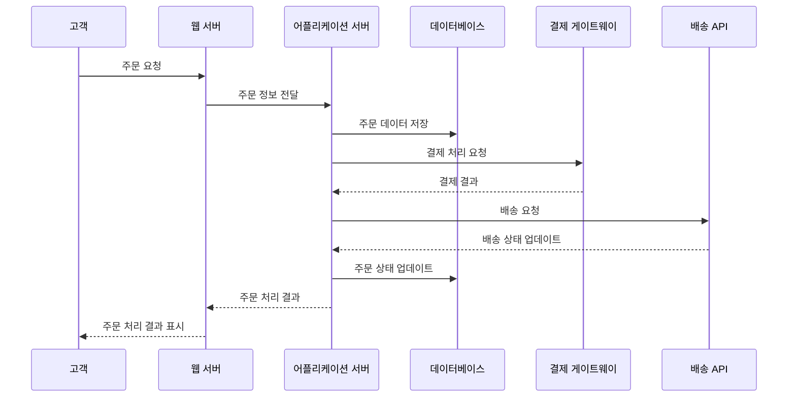
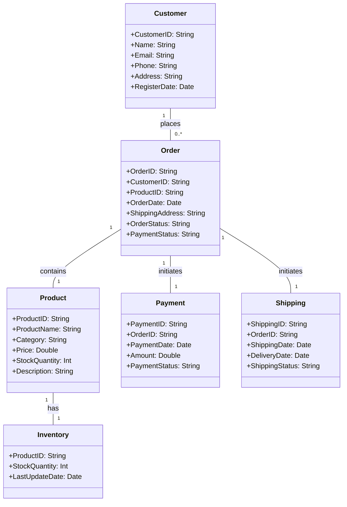
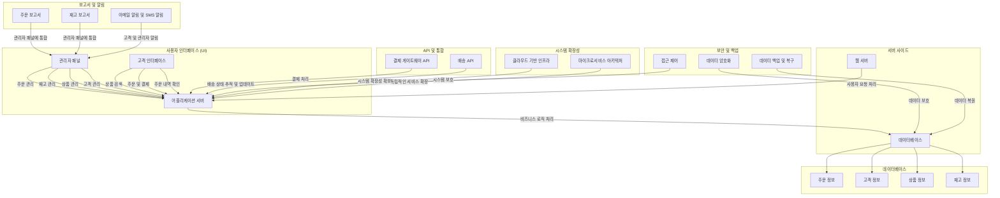

# ChatGPTReport

## 쇼핑몰 주문 관리 시스템 ( sequenceDiagram )

```mermaid

sequenceDiagram
    participant Customer as 고객
    participant WebServer as 웹 서버
    participant AppServer as 어플리케이션 서버
    participant Database as 데이터베이스
    participant PaymentGateway as 결제 게이트웨이
    participant ShippingAPI as 배송 API

    Customer->>WebServer: 주문 요청
    WebServer->>AppServer: 주문 정보 전달
    AppServer->>Database: 주문 데이터 저장
    AppServer->>PaymentGateway: 결제 처리 요청
    PaymentGateway-->>AppServer: 결제 결과
    AppServer->>ShippingAPI: 배송 요청
    ShippingAPI-->>AppServer: 배송 상태 업데이트
    AppServer->>Database: 주문 상태 업데이트
    AppServer-->>WebServer: 주문 처리 결과
    WebServer-->>Customer: 주문 처리 결과 표시

```

## 쇼핑몰 주문 관리 시스템 ( classDiagram )

```mermaid
classDiagram
    class Order {
        +OrderID: String
        +CustomerID: String
        +ProductID: String
        +OrderDate: Date
        +ShippingAddress: String
        +OrderStatus: String
        +PaymentStatus: String
    }
    class Customer {
        +CustomerID: String
        +Name: String
        +Email: String
        +Phone: String
        +Address: String
        +RegisterDate: Date
    }
    class Product {
        +ProductID: String
        +ProductName: String
        +Category: String
        +Price: Double
        +StockQuantity: Int
        +Description: String
    }
    class Inventory {
        +ProductID: String
        +StockQuantity: Int
        +LastUpdateDate: Date
    }
    class Payment {
        +PaymentID: String
        +OrderID: String
        +PaymentDate: Date
        +Amount: Double
        +PaymentStatus: String
    }
    class Shipping {
        +ShippingID: String
        +OrderID: String
        +ShippingDate: Date
        +DeliveryDate: Date
        +ShippingStatus: String
    }

    Customer "1" -- "0..*" Order : places
    Order "1" -- "1" Product : contains
    Product "1" -- "1" Inventory : has
    Order "1" -- "1" Payment : initiates
    Order "1" -- "1" Shipping : initiates


```

## 쇼핑몰 주문 관리 시스템 ( Flow Chart )

```mermaid
graph TD

    %% Subgraphs for User Interface
    subgraph "사용자 인터페이스 (UI)"
        A1[관리자 패널] -->|주문 관리| A2[서버 사이드]
        A1 -->|재고 관리| A2
        A1 -->|상품 관리| A2
        A1 -->|고객 관리| A2
        A3[고객 인터페이스] -->|상품 검색| A2
        A3 -->|주문 및 결제| A2
        A3 -->|주문 내역 확인| A2
    end

    %% Subgraphs for Server Side
    subgraph "서버 사이드"
        A2[어플리케이션 서버] -->|비즈니스 로직 처리| B1[데이터베이스]
        B2[웹 서버] -->|사용자 요청 처리| A2
    end

    %% Subgraphs for Database
    subgraph "데이터베이스"
        B1 --> C1[주문 정보]
        B1 --> C2[고객 정보]
        B1 --> C3[상품 정보]
        B1 --> C4[재고 정보]
    end

    %% Subgraphs for API Integration
    subgraph "API 및 통합"
        D1[결제 게이트웨이 API] -->|결제 처리| A2
        D2[배송 API] -->|배송 상태 추적 및 업데이트| A2
    end

    %% Subgraphs for Security and Backup
    subgraph "보안 및 백업"
        E1[데이터 암호화] -->|데이터 보호| B1
        E2[접근 제어] -->|시스템 보호| A2
        E3[데이터 백업 및 복구] -->|데이터 복원| B1
    end

    %% Subgraphs for Reporting and Notifications
    subgraph "보고서 및 알림"
        F1[주문 보고서] -->|관리자 패널에 통합| A1
        F2[재고 보고서] -->|관리자 패널에 통합| A1
        F3[이메일 알림 및 SMS 알림] -->|고객 및 관리자 알림| A1
    end

    %% Subgraphs for System Scalability
    subgraph "시스템 확장성"
        G1[클라우드 기반 인프라] -->|시스템 확장성 확보| A2
        G2[마이크로서비스 아키텍처] -->|독립적인 서비스 확장| A2
    end

```
